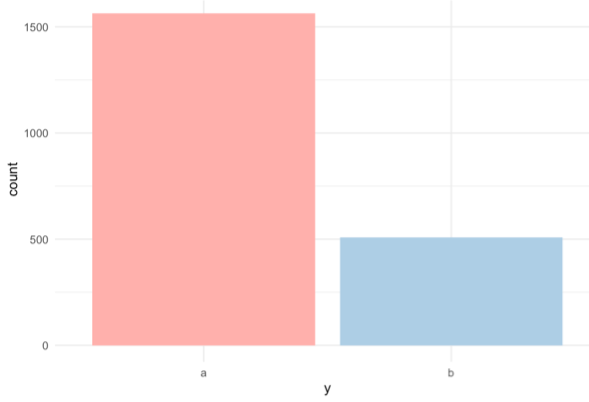
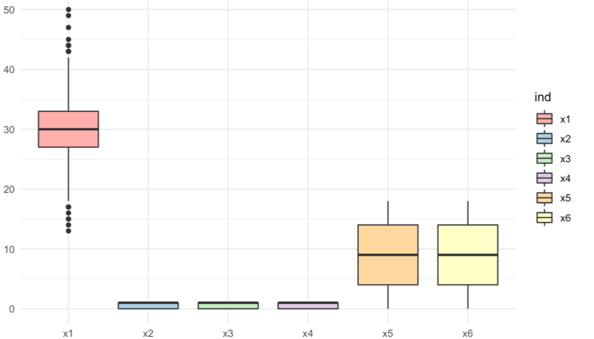
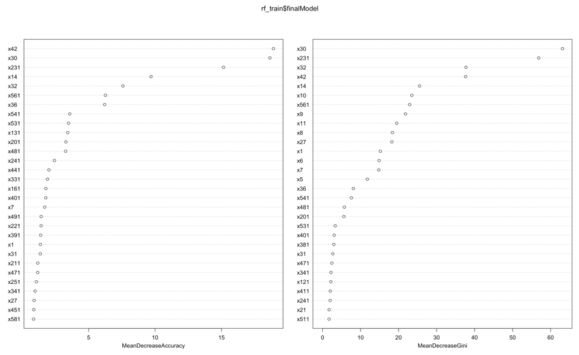

```{r setup, include=FALSE}
knitr::opts_chunk$set(echo = TRUE, fig.align = "center", message = FALSE, warning = FALSE, error = FALSE)
```

<style>
#TOC {
 color: 
 font-family: Calibri;
 background-color:
 border-color: darkred;
}
#header {
 color: darkred;
 font-family: Calibri;
 background-color:
}
body {
 font-family: Calibri;
 }
 
</style>

## 1. Introduction

This is an anonymous binary classification data which consists of numeric and binary features. Normally before training models, we can apply some feature engineering processes. Since there is no information about the features and we do not have an idea what features represent, we cannot make up new features due to the chance of choosing two irrelevant columns.  
Before moving on to the model creation step, we need to check some information about the data. There is no duplicated or missing values; therefore, value imputation process is not necessary. As descriptive analysis, we have checked the correlation between the features, and we have thought it may be a good approach to exclude highly correlated features. We have also removed the features with zero variance. 

The target value consists of two classes which are “a”, and “b”. Since we are dealing with a binary classification problem, we should transform the target variable from character to factor. We have 75% of data with one class and the rest is in the other class. It means that this data is an imbalanced classification data.  One potential problem with imbalanced data is not being able to understand the pattern for minority class.  Minority class refers to the class that has lower instances rather than the other class. This issue may drive the model to predict all instance from the majority class, which may end up with a high accuracy score. In this type of problems, predicting minority class correctly is more important than predicting the majority class correctly.


<center>



</center>

Our aim in this study is to build the best classification model for this imbalanced data in the terms of performance measure which is the mean of Area under the ROC curve (AUC) and Balanced Error Rate (BER) score. Therefore, we are expected to maximize both metrics. Area under the ROC curve (AUC) is a performance measurement for the classification problems at various threshold settings. ROC is a probability curve and AUC represent the degree or measure of separability. In other words, it presents how much the model is capable of distinguishing between classes. Balanced Error Rate (BER) is the average of the proportion of wrong classification in each class. Since the classes are imbalanced, an effort should be made in order to minimize the error rate on each class. Although AUC is correlated with BER, AUC gives better idea about the performance for binary classification problems. 

The proposed approach in this project consists of two levels. First of all, the imbalance problem of the data set is addressed and tried to be solved by some methods. These methods are sampling, feature extraction and cost sensitive learning. Later, both linear and non-linear potential models were constructed and the model with the best performance measure was selected. 


## 2. Related literature

A two-class data set is said to be imbalanced if one of the classes is represented by a very small number of instances (minority class) in comparison to the other (majority) class. The class imbalance problem has emerged as machine learning matured therefore it is a rather new problem in the field. It has received significant attention recently in research areas such as Machine Learning, Pattern Recognition, Data Mining, and Knowledge Discovery. The ratio of the imbalance between the large and small class can be as drastic as 1 to 100, 1 to 1,000, or 1 to 10,000 and sometimes even more (Chawla, et al., 2004).

Classification models attempt to reduce the error rate however they do not take the data distribution into consideration. Since standard learners are often biased towards the majority class It has been observed that class imbalance may cause a significant deterioration in the performance (García, et al., 2012).

Class imbalance issue is especially important in real-world applications where it is often costly to misclassify examples of the minority class. Furthermore, in many data mining tasks often, it is the rare classes are of primary interest (Weiss, 2004). For example, customer churn is an example to these rare event in service industries, but of great interest and great value (Burez & Van den Poel, 2009). Batista, et al.(2004) also mentions that medical records regarding a rare disease are also examples to datasets with imbalance where there is a large number of patients who do not have that disease. Medical datasets are often not balanced in their class labels (Rahman & Davis, 2013). García, et al. (2012) notes that the class imbalance is prevalent in many real-life applications. Chawla, et al. (2004) lists some applications that suffer from class imbalance as fraud/intrusion detection, risk management, text classification, and medical diagnosis/monitoring. In literature there are articles that tackle class imbalance problems on fields such as fraud detection in mobile telephone communications or credit cards, detection of oil spills in satellite radar images, text categorization, credit assessment, prediction of customer insolvency, and translation initiation site recognition in DNA sequences (García, et al., 2012).

Weiss (2004) defined six categories of problems that arise with datasets with class imbalance. The article also proposed methods that can be used to tackle each problem.
1. Using improper evaluation metrics. 
2. Absolute rarity where the number of examples associated with the rare class is so small that makes it difficult to detect regularities within the rare class. 
3. Relative rarity where objects are not rare in absolute sense, but are rare relative to other objects. Nonetheless imbalance makes it hard for greedy search heuristics, and more global methods (such as decision trees).
4. Data fragmentation: Many data mining algorithms, like decision trees, employ a dividing approach, where the original problem is decomposed into smaller problems. This results with instance space partitioning into smaller pieces which will contain less data. 
5. Inappropriate bias is a problem because generalizing from specific examples requires a bias and without it inductive leaps are not possible hence learning cannot occur. The bias of a data mining system is therefore critical to its performance. Many learners utilize a general bias in order to foster generalization and avoid overfitting. This bias can impact the ability to learn minority classes. 
6. Noise has a greater impact on minority classes.

Our data does not have absolute rarity. We have a class imbalance with a 3 to 1 ratio. Some approaches given in the literature that we can benefit from are: Learn only the rare class, segmenting the data, over and under sampling, non-greedy search techniques, cost sensitive learning, more appropriate evaluation metrics, boosting (Weiss, 2004). We have considered these suggestions. And we decided to try over and under sampling methods. Also, we will try less greedy approaches (For example, we know that random forest is less greedy compared to CART). Furthermore, decided to try a boosting method: Stochastic gradient boosting. We also think that as our accuracy metric will be mean of AUC and Balanced Error Rate it will be an appropriate evaluation metric for our problem.

A number of solutions to the class-imbalance problem were previously proposed in the literature. Class imbalance problem can be tackled both at the data and algorithmic levels. At the data level, these solutions include different forms of re-sampling such as random oversampling with replacement, random under sampling, directed oversampling, directed under sampling, oversampling with informed generation of new samples, and combinations of the mentioned techniques. At the algorithmic level, solutions include adjusting the costs of the classes. When working with decision trees adjusting the probabilistic estimate at the tree leaf adjusting the decision threshold are options to achieve this (Japkowicz, 2000), (Chawla, 2009), (Chawla, et al., 2004).

In literature under sampling performs better in generaly for methods considering the area under the ROC curve (AUC) (Batista, et al., 2004). However, the main drawback of under sampling is that potentially useful information contained in these ignored examples is neglected. (Liu, et al., 2008). Chawla, et al. (2002) argued that a combination of over-sampling the minority class and under sampling the majority class can achieve better area under the ROC curve performance than only under-sampling the majority class. The authors showed that the proposed method SMOTE (Synthetic Minority Over-sampling Technique) can improve the accuracy of classifiers for a minority class. SMOTE provides a new approach to over-sampling. The paper argues that the combination of SMOTE and under-sampling performs better than plain under-sampling.

We plan to tackle the class imbalance problem both at data and algorithmic level. In many data mining tasks such medical diagnosis the minority classes are of primary interest and the metrics that do not take this into account generally do not perform well in these situations (Weiss, 2004). One solution is to use cost-sensitive learning methods therefore we will try and compare different sampling methods and on top we will consider costing approaches. Pazzani, et al. (1994) proposed cost sensitive learning approaches in order to investigate learning or revising classification procedures that attempt to reduce the cost of misclassified examples rather than the number of misclassified examples. The general idea of the method is based on assumption that in many problems, the cost of all errors is not equal. The cost of making an error can depend upon both the predicted class of the example and the actual class of an example. 

## 3. Approach

In our project, we have investigated the classification model that will give the best performance in an imbalance data. For this reason, we have first examined the features in the data with boxplots, then we have examined the variances for each feature. We have also created a correlation matrix for relationships between features. After having an overview, we have continued for the modeling section. 
There are different methods available for classification of imbalance dataset which is divided into three main categories, data preprocessing approach, feature selection approach, and the algorithmic approach. Each of this technique has their own advantages and disadvantages. We have tried to combine these strategies in our project. According to the temporal flow, these methods are followed as below: 
### 3.1. Data Preprocessing Approach
In data-preprocessing technique, sampling is applied on imbalanced data

**1.	Original data:** In order to make comparisons, we have first tried the original data without applying any sampling methods. The advantage of this method is that we do not lose any information about the data. However, as a disadvantage, we may not have very accurate predictions because of this replication process.

**2.	Under sampling:** We have created a subset from majority class which contains as many instances as minority class has. Therefore, we have obtained a data which has minority class*2 instances to use in our models. The advantage of this method is that since there is no replication process, models can be created faster when there is a great amount of data. The disadvantage of this method is that we lose some information in the data.

**3.	Oversampling:** We have created replications in order to increase the number of instances in the minority class. At the end, we have obtained a data which has majority class*2 instances to use in our models.

**4.	Under sampling and Oversampling:** We have combined the under sampling and oversampling approaches. Therefore, this method presents advantages and disadvantages of both methods.

**5.	Synthetic Data Generation:** By using the method named SMOTE, new rows between the existing instances in the minority class are generated synthetically in order to address the imbalance dataset problem. The advantage of this method is that we are generating data without losing information or replication. However, as a disadvantage, we may create some instances that could be from the majority class. It is a very common technic to use for imbalanced data.

### 3.2. Future Selection Approach
There are some reasons to use feature selection in machine learning. These approaches enable the learning algorithms to train faster, and improve the accuracy of the model. Also, future selection reduces the complexity, and overfitting of a model. 

**1.	Excluding Features with Variance <0.1:** We have excluded some features in which the variance among this feature is less than 0.1. By doing so, we have thought we keep the most important features while excluding the ones which are not effective in the terms of explaining the target value. Also some 0-1 features were given numeric we transformed them to binary factors.

<center>


</center>

**2.	Variable Importance Plots:** Random forest has the ability to present the most important variables in the data. The first splitting variables give the sense that, they effect the target mostly. Therefore, by using random forest approach we have plotted the variable importance plots in order to have a list of the most significant variables in descending order by a mean decrease in Gini. The top variables contribute more to the model than the bottom ones. According to these plots, we have chosen the top variables to be kept in our model.

<center>



</center>

**3.	Recursive Feature Elimination:** We have also tried the Recursive Feature Elimination method which fits a model and removes the weakest features until the specified number of features is reached. 

### 3.3. Algorithmic Approach
**1.	Cost Sensitive Learning Methods:** Cost sensitive learning methods mainly try to maximize a loss function associated to a dataset. This approach tries to minimize the cost of misclassification. We have used this approach as an algorithmic level method in our models. The advantage of this approach is that we can force the model to classify the target value rather than predicting all instance from the majority class. The disadvantage is that we may not find the best cost matrix for the model.

### 3.4. Models

After dealing with the imbalance dataset problem and feature selection process, we have tried both linear and non-linear models in our classification problem. First, we have created Generalized Linear Model using Ridge and Lasso Penalized Regression Approaches. As it is explained in literature review, we should use less greedy approaches such as non-linear methods Random Forest and Stochastic Gradient Boosting. We have constructed these models with the best imbalance overcoming approach mentioned above. 


## 4. Results

To summarize the steps followed in the model approach part, first we have tried to address the imbalance problem by using methods such as sampling, feature extraction, and cost sensitive learning. Later, models Generalized Linear Model using Ridge and Lasso, Random Forest, and Stochastic Gradient Boosting are applied to the new data set. The obtained performance measures from these models vary between 75% and %89. The best model is obtained by using the subset of the available data with under sampling and feature extraction. The feature extraction method was excluding the features in which variance is below 0.1. Later, Stochastic Gradient Boosting method is applied to the obtained sub data. The performance measure on the validation data is obtained as 89%. 

## 5. Conclusion and Future Work

It can be concluded that data preprocessing provides practically better solutions than the other methods in the terms of balancing data, due to the reason that it allows adding or deleting information. The feature selection algorithm is sensitive to the nature of the problem; therefore, it may not be used always. Applying two or more techniques together gives better solutions for class imbalance problems. The reason why the data used in under sampling gives better results may be that although the number of instances in the minority class is relatively small, it is sufficient to build a model.

There are still many algorithms which combine different methods in order to overcome imbalance classification problems. For example, AdaBoost.NC is an ensemble learning algorithm which has the properties of negative correlation learning and boosting method. Another powerful method in imbalance datasets is boosting. For example, RUSBoost, SMOTEBoost is an example of boosting algorithm (Longadge & Dongre, 2013). These methods may be used for further studies in order to find better models. 


## 6. Code

You can find codes for the project from this [link](https://github.com/BU-IE-582/fall20-TahaBayaz/tree/master/Project/Project.html)

## 7. References

- Batista, G. E., Prati, R. C. & Monard, M. C., 2004. A study of the behavior of several methods for balancing machine learning training data. ACM SIGKDD explorations newsletter, 1(6), pp. 20-29.
- Burez, J. & Van den Poel, D., 2009. Handling class imbalance in customer churn prediction. Expert - Systems with Applications, 36(3), pp. 4626-4636.
- Chawla, N. V., 2009. Data mining for imbalanced datasets: An overview. Data mining and knowledge discovery handbook, pp. 875-886.
- Chawla, N. V., Bowyer, K. W., Hall, L. O. & Kegelmeyer, W. P., 2002. SMOTE: synthetic minority over-sampling technique. Journal of artificial intelligence research, Issue 16, pp. 321-357.
- Chawla, N. V., Japkowicz, N. & Kotcz, A., 2004. Special issue on learning from imbalanced data sets. ACM SIGKDD explorations newsletter , 1(6), pp. 1-6.
- García, V., Sánchez, J. S. & Mollineda, R. A., 2012. On the effectiveness of preprocessing methods when dealing with different levels of class imbalance. Knowledge-Based Systems , 1(25), pp. 13-21.
- Japkowicz, N., 2000. Learning from imbalanced data sets: a comparison of various strategies. Menlo Park, CA, AAAI Press, pp. . Vol. 68. AAAI Press Menlo Park, CA, 2000..
- Liu, X. Y., Wu, J. & Zhou, Z. H., 2008. Exploratory undersampling for class-imbalance learning. IEEE Transactions on Systems, Man, and Cybernetics, Part B (Cybernetics), 2(39), pp. 539-550.
- Longadge, R. & Dongre, S., 2013. Class imbalance problem in data mining review.. arXiv preprint arXiv:1305.1707.v.
- Pazzani, M. M. C. et al., 1994. Reducing misclassification costs. In Machine Learning Proceedings, pp. 217-225.
- Rahman, M. M. & Davis, D. N., 2013. Addressing the class imbalance problem in medical datasets. International Journal of Machine Learning and Computing, 2(3), p. 224.
- Weiss, G. M., 2004. Mining with rarity: a unifying framework. ACM Sigkdd Explorations Newsletter, 1(6), pp. 7-19.


